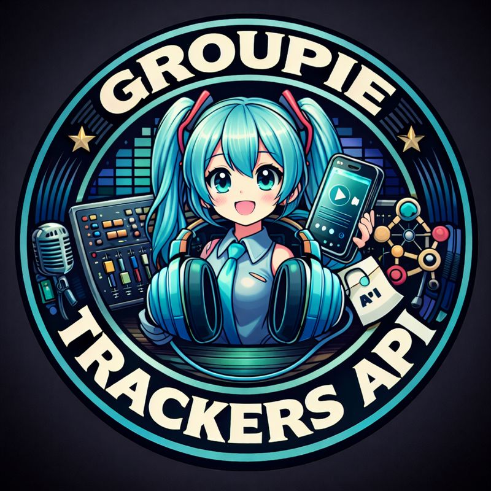

# 🎵 Groupie Trackers



## 📋 Objectif du Projet

Groupie Trackers est une application web développée en Go qui permet d'afficher, rechercher et filtrer des artistes musicaux ainsi que leurs concerts à partir de l'API officielle Groupie Trackers. Le projet offre une expérience utilisateur interactive avec visualisation cartographique des lieux de concerts.

### Fonctionnalités principales :
- 🎤 Affichage d'une liste complète d'artistes
- 🔍 Recherche avancée (par nom d'artiste ou membre)
- 🎛️ Filtres multiples (année de création, nombre de membres)
- 📍 Carte interactive des lieux de concerts (Leaflet.js)
- 🎨 Interface moderne avec animations fluides
- 📱 Design responsive

---

## 🚀 Comment Lancer le Projet

### Prérequis
- Go 1.16 ou supérieur installé sur votre machine
- Connexion internet (pour l'API et les cartes)

### Installation et Démarrage

1. **Cloner le repository**
```bash
git clone <votre-repository>
cd groupie-tracker
```

2. **Vérifier la structure du projet**
```
groupie-tracker/
├── cmd/
│   └── main.go
├── server/
│   ├── server.go
│   └── handlers.go
├── web/
│   ├── html/
│   ├── css/
│   ├── js/
│   └── img/
└── README.md
```

3. **Lancer le serveur**
```bash
go run cmd/main.go
```

4. **Accéder à l'application**
Ouvrez votre navigateur et allez sur :
```
http://localhost:8080
```

Le serveur affichera :
```
✅ Server running at http://localhost:8080
```

---

## 🛣️ Routes Principales et Leurs Fonctions

| Route | Méthode | Fonction |
|-------|---------|----------|
| `/` | GET | Page d'accueil avec présentation du projet |
| `/albums` | GET | Liste complète des artistes avec filtres |
| `/artists` | GET | Résultats de recherche filtrés (query params) |
| `/details/{name}` | GET | Page détaillée d'un artiste avec concerts et carte |
| `/search` | GET | API pour l'autocomplétion de recherche |
| `/submit` | POST | Traitement des formulaires (redirection) |
| `/css/*` | GET | Fichiers CSS statiques |
| `/js/*` | GET | Fichiers JavaScript statiques |
| `/img/*` | GET | Fichiers images statiques |

### Paramètres de Requête (Query Parameters)

**Route `/artists`** :
- `query` : Recherche par nom d'artiste
- `member` : Recherche par nom de membre
- `year_min` : Année minimale de création (ex: 1990)
- `year_max` : Année maximale de création (ex: 2020)
- `members_count` : Nombre de membres (ex: 1, 2, 3, 4, 5+)

**Exemple** :
```
/artists?query=queen&year_min=1970&year_max=1980&members_count=4
```

---

## ✨ Fonctionnalités Implémentées

### 🎯 Fonctionnalités Obligatoires

1. **Affichage des Artistes**
   - Liste complète des artistes avec images
   - Informations de base (nom, image)
   - Navigation vers pages détaillées

2. **Page de Détails**
   - Informations complètes de l'artiste
   - Liste des membres
   - Année de création
   - Lieux et dates de concerts
   - Carte interactive avec marqueurs

3. **Recherche**
   - Barre de recherche avec autocomplétion
   - Recherche par nom d'artiste
   - Recherche par nom de membre
   - Suggestions en temps réel

4. **Filtres**
   - Filtre par année de création (min/max)
   - Filtre par nombre de membres (1, 2, 3, 4, 5+)
   - Combinaison de plusieurs filtres
   - Bouton "Clear Filters" pour réinitialiser

5. **Gestion d'Erreurs**
   - Page 404 personnalisée
   - Gestion des erreurs API
   - Validation des routes

### 🌟 Fonctionnalités Bonus

1. **Carte Interactive (Leaflet.js)**
   - Géolocalisation automatique des lieux de concerts
   - Marqueurs interactifs avec popups
   - Zoom et navigation sur la carte
   - Intégration OpenStreetMap
   - Liste des concerts sous la carte

2. **Animations et Transitions**
   - Animation "warp speed" entre les pages
   - Effet de shimmer sur le titre
   - Animations de cartes d'artistes échelonnées
   - Effets de survol fluides
   - Transitions glassmorphism

3. **Interface Moderne**
   - Design glassmorphism avec backdrop-filter
   - Dégradés animés
   - Style épuré et professionnel
   - Responsive design
   - Background personnalisé (Hatsune Miku)

4. **Intégrations Musicales**
   - Liens directs vers Spotify
   - Liens directs vers Deezer
   - Ouverture dans de nouveaux onglets

5. **UX Améliorée**
   - Autocomplétion intelligente (artistes et membres)
   - Switch pour changer le type de recherche
   - Boutons fixes pour navigation rapide
   - Feedback visuel sur les interactions
   - Troncature automatique des textes longs

### 🔧 Fonctionnalités Techniques

- **Architecture MVC** : Séparation claire entre serveur, handlers et templates
- **API REST** : Consommation de l'API Groupie Trackers
- **Templates Go** : Rendu dynamique avec html/template
- **Geocoding** : Utilisation de l'API Nominatim pour la géolocalisation
- **Rate Limiting** : Gestion des requêtes API avec délais
- **Error Handling** : Gestion robuste des erreurs
- **Static File Serving** : Serveur de fichiers statiques optimisé

---

## 🎨 Technologies Utilisées

### Backend
- **Go** : Langage principal
- **net/http** : Serveur HTTP natif
- **html/template** : Moteur de templates
- **encoding/json** : Manipulation JSON

### Frontend
- **HTML5** : Structure sémantique
- **CSS3** : Styles avancés (glassmorphism, animations)
- **JavaScript (Vanilla)** : Interactions dynamiques
- **Leaflet.js** : Bibliothèque de cartographie

### APIs Externes
- **Groupie Trackers API** : Données des artistes
- **Nominatim (OpenStreetMap)** : Géocodage
- **Spotify** : Liens vers les artistes
- **Deezer** : Liens vers les artistes

---

## 📁 Structure du Projet

```
groupie-tracker/
├── cmd/
│   └── main.go              # Point d'entrée de l'application
├── server/
│   ├── server.go            # Configuration du serveur
│   └── handlers.go          # Gestionnaires de routes
├── web/
│   ├── html/
│   │   ├── index.html       # Page d'accueil
│   │   ├── albums.html      # Liste des artistes
│   │   ├── details.html     # Détails d'un artiste
│   │   └── 404.html         # Page d'erreur
│   ├── css/
│   │   ├── style.css        # Styles page d'accueil
│   │   ├── albums.css       # Styles liste artistes
│   │   ├── details.css      # Styles page détails
│   │   └── 404.css          # Styles page erreur
│   ├── js/
│   │   ├── script.js        # Recherche et autocomplétion
│   │   ├── map.js           # Carte interactive
│   │   └── transitions.js   # Animations de page
│   └── img/
│       ├── logo.jpeg        # Logo du projet
│       └── miku.jpg         # Background
└── README.md
```

---

## 🎯 Exemples d'Utilisation

### Rechercher un artiste
1. Sur la page `/albums`, utilisez la barre de recherche
2. Tapez les premières lettres (ex: "que" pour Queen)
3. Sélectionnez dans les suggestions ou appuyez sur Entrée

### Filtrer par critères
1. Définissez l'année minimale/maximale
2. Sélectionnez le nombre de membres
3. Cliquez sur "Apply Filters"
4. Utilisez "Clear Filters" pour réinitialiser

### Voir les concerts sur carte
1. Cliquez sur un artiste
2. Faites défiler jusqu'à la section "Concert Locations"
3. Explorez la carte interactive
4. Cliquez sur les marqueurs pour voir les détails

---

## 🐛 Gestion des Erreurs

L'application gère plusieurs types d'erreurs :

- **404 Not Found** : Page personnalisée avec animation
- **Erreurs API** : Logging côté serveur
- **Erreurs de parsing JSON** : Gestion silencieuse
- **Erreurs de géocodage** : Fallback gracieux

---

## 📝 Notes Importantes

- Le serveur doit avoir accès à Internet pour :
  - Récupérer les données de l'API Groupie Trackers
  - Géocoder les lieux de concerts
  - Charger les tuiles de carte OpenStreetMap
  
- Les requêtes de géocodage sont limitées à 1 par seconde pour respecter les limites de l'API Nominatim

- Les animations CSS utilisent des propriétés modernes (backdrop-filter) qui peuvent ne pas être supportées sur tous les navigateurs

---

© 2025 Groupie Tracker

---

## 📄 Licence

Ce projet est réalisé dans un cadre éducatif.

---

## 🔗 Liens Utiles

- [API Groupie Trackers](https://groupietrackers.herokuapp.com/api)
- [Documentation Leaflet.js](https://leafletjs.com/)
- [Documentation Go net/http](https://pkg.go.dev/net/http)
- [Nominatim API](https://nominatim.org/)
